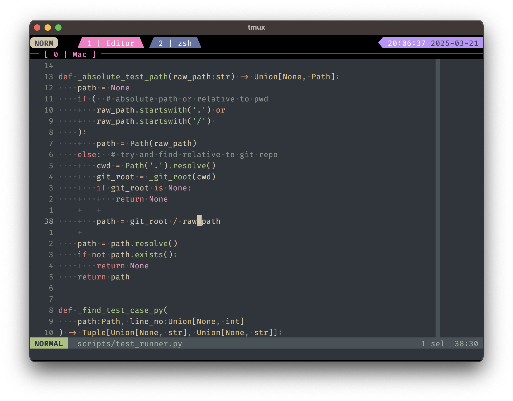

# Minimalist Linux development environment

## features
- all runtime dependencies are stored in a centralized location ($SCRATCH)
	- lsp runtimes
	- python virtualenvs
	- rust build artifacts: .rustup and .cargo
	- helix_runtime
- define root directory where code lives ($USER_ROOT)
- `gu` alias to go to $USER_ROOT
- `cz` alias to edit "~/.zshrc"
- ~~nvim~~
- helix editor
- Python lsp
- Typescript and Vue lsp
- 'jupyter' to start jupyterlab in "$USER_ROOT/notebooks" through a docker container
- tmux

## requirements
_install globally or add to path in "config/.zshrc"_
- helix
- git
- lazygit
- docker
- tmux
- zsh
- terminal emulator with true color support (kitty)
- nerdfont (firaCode)

### optional requirements (stacks)
- python
- node
- rustup (install after initializing to direct arifacts to $SCRATCH)

## install
1. manually install and set "firaCode" nerdfont in terminal emulator
2. adjust $SCRATCH, $DEVENV_ROOT and $USER_ROOT in "config/.zshrc"
3. ensure default shell is set to zsh (`chsh -s /bin/zsh`)
4. if it exists, delete "~/.config/helix/runtime"
5. run `ln -s config/.zshrc ~/.zshrc`
6. restart shell to pick up new config
7. run `./initialize.sh`
8. run `hx -g fetch` and `hx -g build` to build helix treesitter grammars
9. setup stacks of choice by running `./build_package_*.sh`
10. restart shell to pick up new config

NOTE
Config files live in "config" and represents XDG_CONFIG_HOME ("~/.config")
The installation process symlinks these

## test
run `start.sh` to open a command line interface in a docker container to a blank linux install and setup all the tools from scratch
Update $USER_ROOT in this script to point to a folder of code you want to test on. This gets mounted in the container as read only. Remove ":ro" from bind to make editable
_DockerFile does not work on Apple-silicon; compile targets are missing. Scripts can still be tested_

## basics

### tmux
`tmux` start new tmux session
`tmux attach` attach to last tmux session

in tmux
pfx = [C-space] prefix; all tmux keybindings start with this (indicated top-left TMUX mode)
pfx,q close pane
pfx,Q close window
pfx,d detach from tmux session
pfx,[hjkl] go to pane in that direction
pfx,s split pane vertically
pfx,v split pane horizontally
pfx,z zoom pane to fullscreen
pfx,n rename pane
pfx,N rename window
pfx,[ enter copy mode (for scrolling back)

while in copy mode (indicated top-left):
[hjkl] move cursor around
C-u scroll up
C-d scroll down

### helix
`hx` start helix
`hx --health` check language features (installed lsps)
`hx --tutor` run helix tutorial to get familiar with basics

modified keys from defaults
- moving through syntax tree
	A-h expand selection to parent scope
	A-j select next sibling
	A-k select previous sibling
	A-l shrink selection to child scope
- align walking through selections to similar keys for walking through search results
	A-n rotate selections forward
	A-N rotate selections backward
- integrated git user interface (**only works within tmux as it uses window-splits**)
	C-g open lazygit

## notes
To run command in vertical split and close on command success:
tmux split-window -v -c "#{pane-current-path}" && tmux send-keys "my_command && tmux kill-pane -t \$TMUX_PANE" C-m

